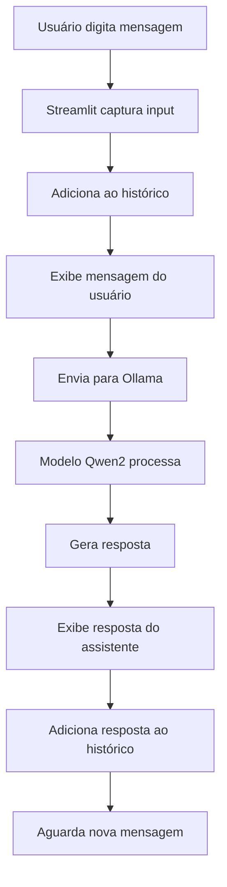

# 🤖 ChatBot Offline com Qwen2

[](https://www.python.org/)
[](https://streamlit.io/)
[](https://ollama.ai/)
[](https://qwen.readthedocs.io/)

> **Assistente de IA Conversacional 100% Local com Privacidade Total**  
> Processamento offline, sem dependência de APIs externas ou conexão à internet

ChatBot inteligente desenvolvido em Python com Streamlit e Ollama, utilizando o modelo Qwen2 para conversas naturais completamente offline, garantindo máxima privacidade e autonomia.

---

## 📖 Sobre o Projeto

**ChatBot Pessoal Offline** é uma solução de IA conversacional que roda **100% localmente** em sua máquina, sem enviar dados para servidores externos. Ideal para quem valoriza privacidade, trabalha com informações sensíveis ou precisa de IA em ambientes sem internet.

### 🎯 Propósito

Mais do que um chatbot comum, o sistema oferece:
- 🔒 **Privacidade Total** - Nenhum dado sai da sua máquina
- ⚡ **Sem Custos de API** - Zero dependência de serviços pagos
- 🌐 **Funciona Offline** - Internet não é necessária após instalação
- 💬 **Conversas Naturais** - Modelo Qwen2 com alta qualidade de resposta
- 📝 **Histórico Persistente** - Mantém contexto durante toda a sessão
- 🎨 **Interface Intuitiva** - Design clean e responsivo com Streamlit

---

## ✨ Funcionalidades Principais

### 💬 **Chat Conversacional**

#### Interface Interativa
- Input de texto estilo chat moderno
- Histórico de mensagens com identificação visual (usuário/assistente)
- Renderização Markdown para respostas formatadas
- Container estilizado com bordas para melhor organização

#### Gerenciamento de Sessão
- **Session State** do Streamlit para persistência de contexto
- Histórico completo de conversas mantido durante a sessão
- Mensagens anteriores visíveis para referência

#### Processamento de IA
- Integração direta com Ollama via Python Client
- Modelo Qwen2 (latest) para geração de respostas
- Tratamento de erros com mensagens amigáveis
- Respostas completas geradas de uma vez

---

## 🏗️ Arquitetura do Sistema

### Fluxo de Funcionamento


### Componentes Técnicos

#### 1. **Frontend (Streamlit)**
- `st.set_page_config()` - Configuração da página (título, layout)
- `st.container(border=True)` - Container estilizado para chat
- `st.chat_message()` - Componente nativo de mensagens de chat
- `st.chat_input()` - Input otimizado para conversação
- `st.session_state` - Gerenciamento de estado da sessão

#### 2. **Backend (Ollama Client)**
- `ollama.Client()` - Cliente Python para Ollama
- `client.generate()` - Método de geração de texto
- Modelo: `qwen2:latest` - LLM de código aberto

#### 3. **Estrutura de Dados**

**Session State - Histórico de Mensagens:**
```python
st.session_state.messages = [
    {"role": "user", "content": "Olá, tudo bem?"},
    {"role": "assistant", "content": "Olá! Estou bem, obrigado..."}
]
```

**Resposta do Ollama:**
```python
response_data = {
    'response': 'Texto gerado pelo modelo...',
    'model': 'qwen2:latest',
    'created_at': '2025-02-10T...',
    # ... outros metadados
}
```

---

## 🚀 Como Executar

### Pré-requisitos

#### 1. **Python 3.11 ou Superior**
```bash
python --version
# Saída esperada: Python 3.11.x ou superior
```

#### 2. **Ollama Instalado**

**Linux:**
```bash
curl -fsSL https://ollama.ai/install.sh | sh
```

**macOS:**
```bash
brew install ollama
```

**Windows:**
- Baixe o instalador em [ollama.ai](https://ollama.ai/download)

**Verificar instalação:**
```bash
ollama --version
```

#### 3. **Modelo Qwen2**
```bash
# Baixar o modelo (~ 4.7GB)
ollama pull qwen2:latest

# Verificar modelos instalados
ollama list
```

---

### Instalação do Projeto

#### Opção 1: Instalação Direta
```bash
# Clone o repositório
git clone https://github.com/seu-usuario/chatbot-qwen2-offline.git

# Entre no diretório
cd chatbot-qwen2-offline

# Instale as dependências
pip install streamlit ollama
```

#### Opção 2: Com Ambiente Virtual (Recomendado)
```bash
# Clone o repositório
git clone https://github.com/seu-usuario/chatbot-qwen2-offline.git
cd chatbot-qwen2-offline

# Crie o ambiente virtual
python -m venv venv

# Ative o ambiente
# Linux/macOS:
source venv/bin/activate
# Windows:
venv\Scripts\activate

# Instale as dependências
pip install streamlit ollama
```

#### Opção 3: Com Poetry
```bash
# Instale Poetry (se não tiver)
pip install poetry

# Clone e entre no diretório
git clone https://github.com/seu-usuario/chatbot-qwen2-offline.git
cd chatbot-qwen2-offline

# Instale dependências
poetry install

# Ative o ambiente Poetry
poetry shell
```

---

### Executar o ChatBot

#### 1. **Inicie o Serviço Ollama**
```bash
# Em um terminal separado
ollama serve
```

#### 2. **Execute o Streamlit**
```bash
# Terminal principal
streamlit run app.py

# O navegador abrirá automaticamente em:
# http://localhost:8501
```

#### 3. **Teste a Conexão**
Digite qualquer mensagem no chat e aguarde a resposta!

---

## 🛠️ Stack Tecnológica

### Core


### IA & Machine Learning


### DevOps


---

## 💡 Casos de Uso

### 🔒 **Empresa com Dados Sensíveis**

**Cenário:** Escritório de advocacia precisa de assistente IA para rascunhar documentos sem expor informações confidenciais

**Solução:**
1. Deploy do ChatBot em servidor interno
2. Processamento 100% local sem conexão externa
3. Histórico de conversas mantido apenas na sessão

**Resultado:**
- ✅ Conformidade total com LGPD/GDPR
- ✅ Zero risco de vazamento de dados
- ✅ Custo zero com APIs de IA

---

### 🌐 **Trabalho em Ambientes Offline**

**Cenário:** Pesquisador de campo sem acesso à internet precisa de assistente IA

**Solução:**
1. Instalação prévia do Ollama e modelo Qwen2
2. ChatBot funcionando offline
3. Respostas rápidas sem latência de rede

**Resultado:**
- ⚡ Produtividade mantida sem internet
- 💰 Economia com planos de dados móveis
- 🔋 Menor consumo de bateria (sem requisições HTTP)

---

### 🎓 **Educação e Aprendizado**

**Cenário:** Estudante quer praticar programação com IA sem custos

**Solução:**
1. Instalação gratuita do ChatBot
2. Perguntas ilimitadas sem cobrança por token
3. Experimentação sem medo de custos

**Resultado:**
- 📚 Aprendizado contínuo sem limites
- 💵 Zero gastos com GPT-4/Claude API
- 🧪 Liberdade para testar e errar

---

### 🎨 **Customizações Possíveis**

#### 1. **Alterar o Modelo**
```python
# Trocar para outro modelo Ollama
response_data = client.generate(
    model="llama2:latest",  # ou "mistral", "codellama", etc.
    prompt=prompt
)
```

#### 2. **Adicionar Temperatura**
```python
response_data = client.generate(
    model="qwen2:latest",
    prompt=prompt,
    options={
        "temperature": 0.7,  # 0.0 = determinístico, 1.0 = criativo
        "top_p": 0.9,
        "top_k": 40
    }
)
```

#### 3. **Streaming de Respostas**
```python
# Exibir texto enquanto é gerado
response_placeholder = st.empty()
full_response = ""

for chunk in client.generate(model="qwen2:latest", prompt=prompt, stream=True):
    full_response += chunk['response']
    response_placeholder.markdown(full_response)
```

#### 4. **Sistema de Prompt**
```python
system_message = "Você é um assistente útil e educado."

response_data = client.generate(
    model="qwen2:latest",
    prompt=prompt,
    system=system_message
)
```

---

## 🚀 Melhorias Futuras

### Roadmap

#### Curto Prazo
- [ ] **Botão de limpar histórico** de conversas
- [ ] **Salvar conversas** em arquivo JSON/TXT
- [ ] **Seletor de modelos** no sidebar (Qwen2, Llama2, Mistral)
- [ ] **Configuração de temperatura** via slider

#### Médio Prazo
- [ ] **Streaming de respostas** palavra por palavra
- [ ] **Upload de documentos** para contexto
- [ ] **Busca no histórico** de conversas
- [ ] **Temas customizáveis** (claro/escuro)

#### Longo Prazo
- [ ] **RAG (Retrieval-Augmented Generation)** com ChromaDB
- [ ] **Multi-sessões** com banco de dados SQLite
- [ ] **Análise de sentimento** das conversas
- [ ] **Export para PDF** com formatação

---


## 🎓 Contexto Acadêmico

### Informações do Projeto

| Item | Detalhe |
|------|---------|
| **Tipo** | Projeto de Portfólio - IA Conversacional |
| **Tecnologias** | Python, Streamlit, Ollama, Qwen2 |
| **Categoria** | Natural Language Processing (NLP) |
| **Complexidade** | Intermediária |

### Competências Demonstradas

1. **🤖 IA Generativa** - Integração com LLMs locais
2. **🐍 Python Avançado** - Manipulação de APIs, gerenciamento de estado
3. **🎨 UI/UX** - Interface conversacional intuitiva
4. **🔒 Segurança** - Processamento local de dados sensíveis
5. **📦 Deployment** - Configuração de ambiente, dependências
6. **📝 Documentação** - README técnico completo
7. **🛠️ DevOps** - Troubleshooting, otimização de performance

---

## 🤝 Contribuindo

Contribuições são bem-vindas!

### Como Contribuir

1. Fork o projeto
2. Crie uma branch (`git checkout -b feature/melhoria`)
3. Commit suas mudanças (`git commit -m 'Adiciona streaming de respostas'`)
4. Push para a branch (`git push origin feature/melhoria`)
5. Abra um Pull Request

### Áreas de Contribuição

- 🤖 **Modelos** - Integração com novos LLMs
- 🎨 **UI/UX** - Melhorias visuais e de usabilidade
- 📊 **Features** - Novas funcionalidades (RAG, multi-sessão)
- 🐛 **Bugs** - Correções e otimizações
- 📝 **Docs** - Melhorias na documentação

---

## 📝 Licença

Este projeto foi desenvolvido para fins **educacionais e de portfólio** e está disponível para:

✅ Uso educacional e estudo  
✅ Modificação e adaptação  
✅ Uso em projetos pessoais e comerciais  
✅ Distribuição com créditos  

⚠️ **Atenção:** O modelo Qwen2 possui licença própria da Alibaba Cloud. Consulte [qwen.readthedocs.io](https://qwen.readthedocs.io/) para detalhes.

---

## 📞 Contato

**Desenvolvedor:** [Aram Bohmann Leite Da Luz]  

[](mailto:arambohmannleitedaluz@gmail.com)
[](https://www.linkedin.com/in/aram-luz-1b0ab1321/)
[](https://github.com/Aram-Bohmann)

---

## 🙏 Agradecimentos

- **Streamlit** - Framework incrível para apps de ML/IA
- **Ollama** - Tornando LLMs locais acessíveis
- **Alibaba Cloud** - Modelo Qwen2 de código aberto
- **Comunidade Python** - Ferramentas e suporte
- **Open Source Community** - Por democratizar IA

---

## 📚 Referências Técnicas

- [Streamlit Documentation](https://docs.streamlit.io/)
- [Ollama Documentation](https://ollama.ai/docs)
- [Qwen2 Model Card](https://qwen.readthedocs.io/)
- [Python Ollama Library](https://github.com/ollama/ollama-python)
- [LLM Best Practices](https://platform.openai.com/docs/guides/prompt-engineering)

---

## 🔗 Links Úteis

- [Ollama Models Library](https://ollama.ai/library) - Catálogo de modelos disponíveis
- [Streamlit Gallery](https://streamlit.io/gallery) - Inspiração para apps
- [Awesome Ollama](https://github.com/jmorganca/awesome-ollama) - Recursos da comunidade
- [Qwen2 Paper](https://arxiv.org/abs/2407.10671) - Artigo científico do modelo

---

<div align="center">

### ⭐ Se este projeto foi útil para você, considere dar uma estrela!

**Desenvolvido com 💙 e 🤖 para IA acessível e privada**

*"IA poderosa não precisa de internet"*

</div>
